# Order Web - Restaurant Order Management System

**Order Web** là ứng dụng web quản lý gọi món và vận hành nhà hàng/quán ăn, được xây dựng bằng **Next.js**, **React**, **Supabase** và **Tailwind CSS**.

Dự án hỗ trợ đầy đủ luồng vận hành từ **khách hàng**, **nhân viên** đến **quản trị viên**:

* Khách hàng quét QR tại bàn để xem menu và gửi order.
* Nhân viên tiếp nhận order, duyệt/từ chối order, theo dõi trạng thái món, kiểm tra bàn và thanh toán hóa đơn.
* Admin quản lý dashboard, nhân viên, món ăn, bàn, QR code, hóa đơn và dữ liệu vận hành nhà hàng.
* Backend dùng Supabase làm database/auth, kết hợp API Route của Next.js.
* Code được tổ chức theo hướng **MVC-like architecture** để dễ bảo trì, mở rộng và phân chia trách nhiệm.

---

## Mục lục

* [Demo giao diện](#demo-giao-diện)
* [Tổng quan chức năng](#tổng-quan-chức-năng)
* [Luồng hoạt động hệ thống](#luồng-hoạt-động-hệ-thống)
* [Phân quyền người dùng](#phân-quyền-người-dùng)
* [Tech stack](#tech-stack)
* [Cấu trúc thư mục](#cấu-trúc-thư-mục)
* [Kiến trúc MVC-like](#kiến-trúc-mvc-like)
* [Database schema](#database-schema)
* [API routes](#api-routes)
* [Biến môi trường](#biến-môi-trường)
* [Cài đặt và chạy dự án](#cài-đặt-và-chạy-dự-án)
* [Ghi chú vận hành](#ghi-chú-vận-hành)
* [Tác giả](#tác-giả)
* [License](#license)

---

## Demo giao diện

> Tất cả ảnh minh họa được đặt trong thư mục:
>
> `src/docs/images`

### 1. Trang menu khách hàng

Trang menu dành cho khách hàng khi quét QR tại bàn. Khách có thể xem món, chọn option/size, thêm ghi chú và gửi order.

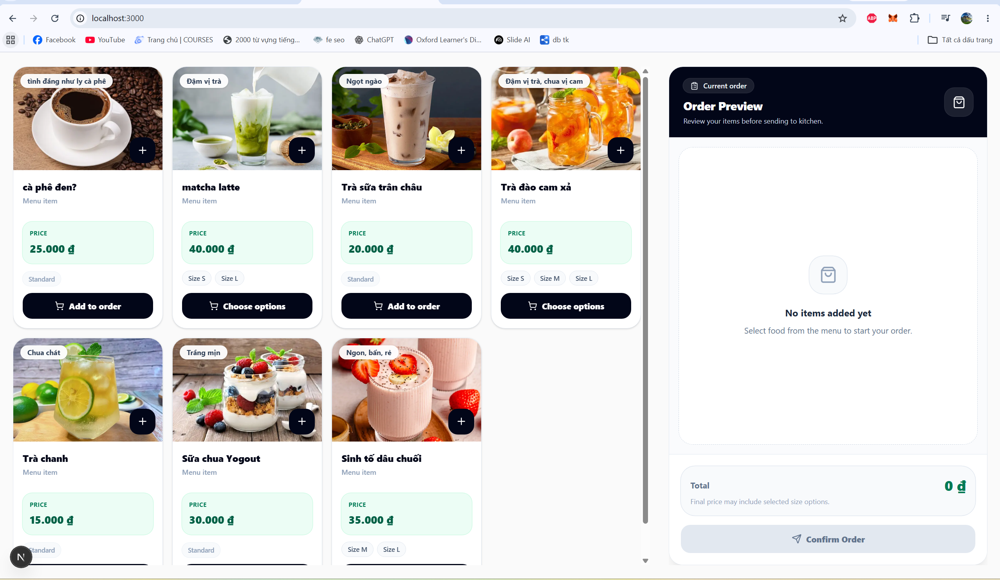

---

### 2. Admin Workspace

Trang tổng quan đầu tiên dành cho admin sau khi đăng nhập. Admin có thể truy cập nhanh dashboard, hóa đơn, bàn, món ăn và các module quản lý chính.

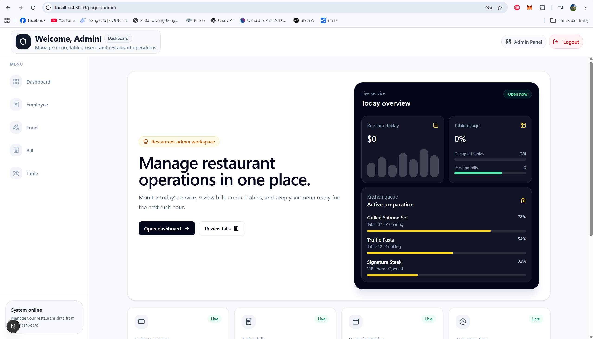

---

### 3. Admin Dashboard

Dashboard hiển thị các chỉ số vận hành như doanh thu, hóa đơn, bàn đang hoạt động, order gần đây và tình hình phục vụ trong ngày.

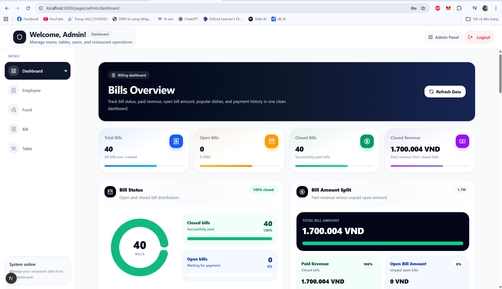

---

### 4. Quản lý nhân viên

Admin có thể thêm nhân viên, cập nhật thông tin, phân quyền `admin` hoặc `staff`, reset mật khẩu và xóa nhân viên khỏi hệ thống.

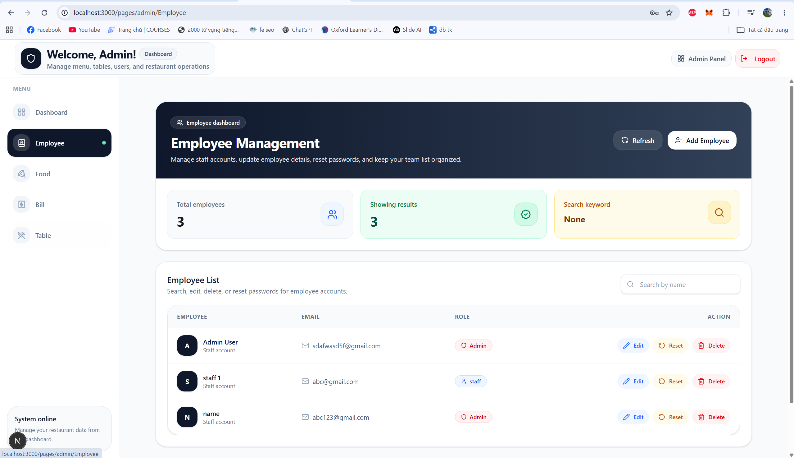

---

### 5. Quản lý món ăn

Admin có thể thêm món, sửa món, xóa món, cập nhật giá, danh mục, danh mục phụ, option món và hình ảnh món ăn.

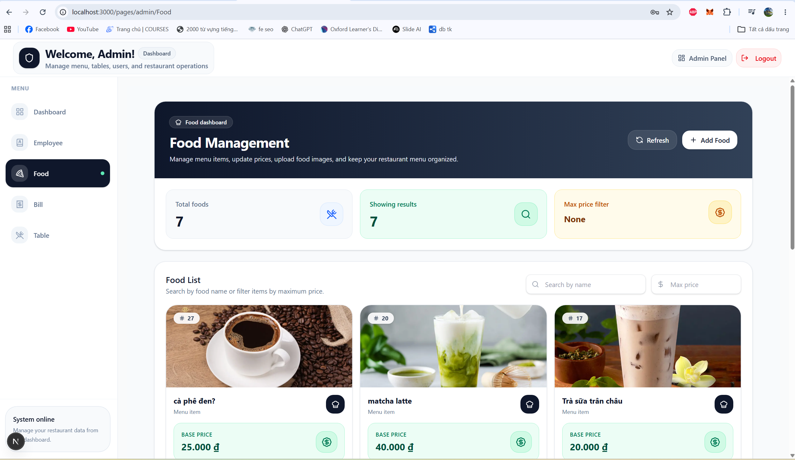

---

### 6. Quản lý bàn và QR Code

Admin quản lý danh sách bàn, tạo QR code cho từng bàn và dùng QR để dẫn khách đến đúng menu/order theo bàn.

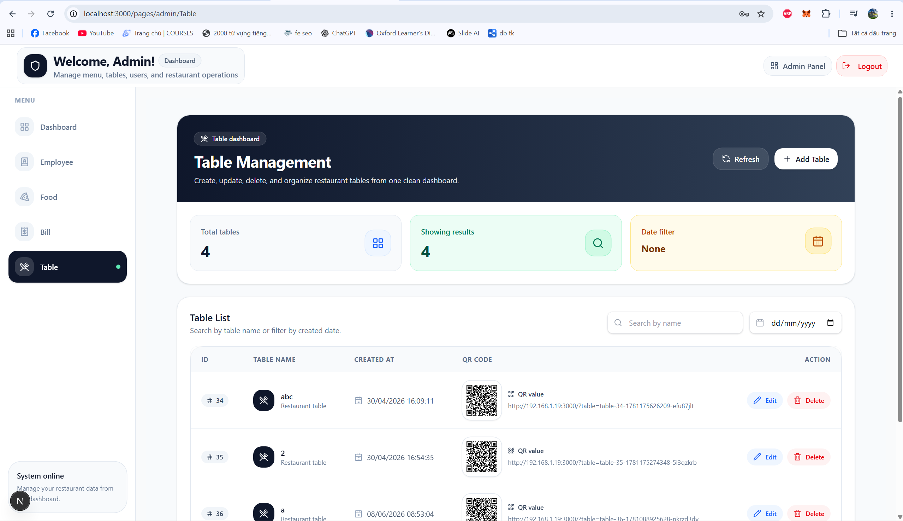

---

### 7. Quản lý hóa đơn

Admin có thể xem hóa đơn đang mở, hóa đơn đã đóng, chi tiết món trong hóa đơn, tổng tiền và trạng thái thanh toán.

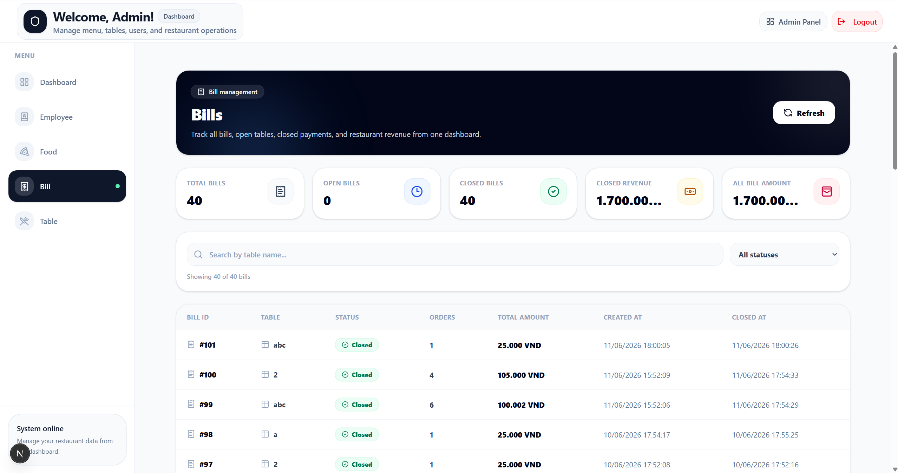

---

### 8. Staff Workspace

Trang làm việc chính của nhân viên. Nhân viên có thể đi tới màn hình xử lý order hoặc kiểm tra bàn/thanh toán.

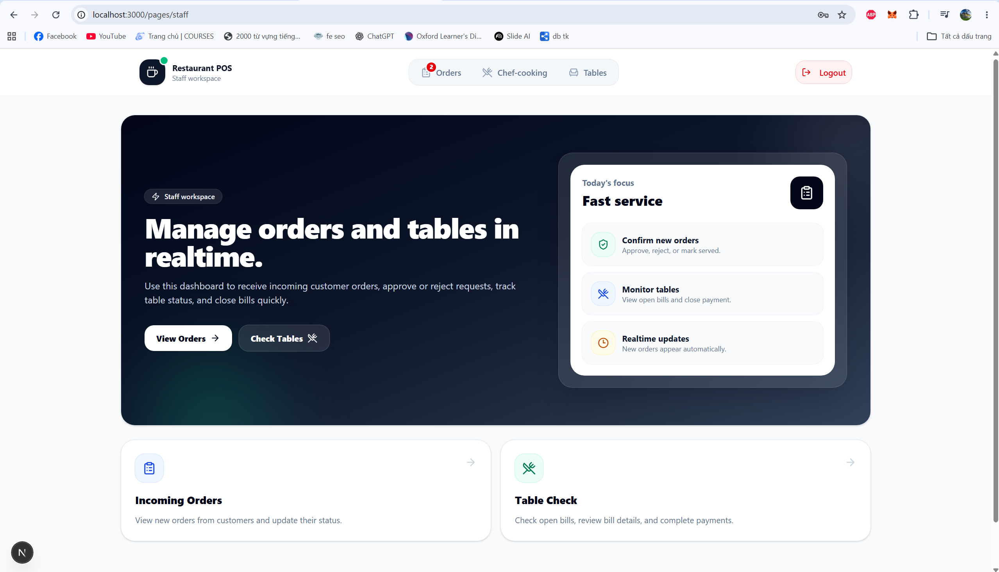

---

### 9. Staff Order Page

Nhân viên tiếp nhận order mới từ khách, kiểm tra chi tiết món, duyệt order, từ chối order hoặc cập nhật trạng thái phục vụ.

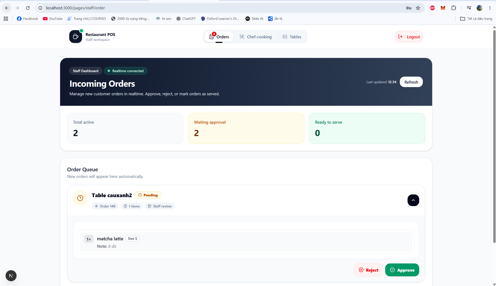

---

### 10. Staff Chef Page

Màn hình hỗ trợ theo dõi order theo hướng bếp/phục vụ, giúp nhân viên biết món nào đang chờ xử lý hoặc sẵn sàng phục vụ.

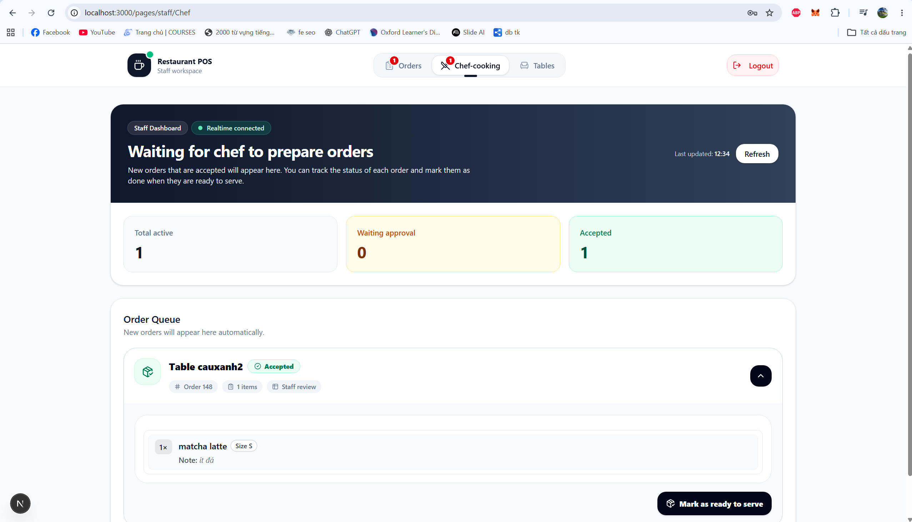

---

### 11. Staff Table Check

Nhân viên kiểm tra bàn, xem bill đang mở, xem chi tiết order của từng bàn và đóng hóa đơn khi khách thanh toán.

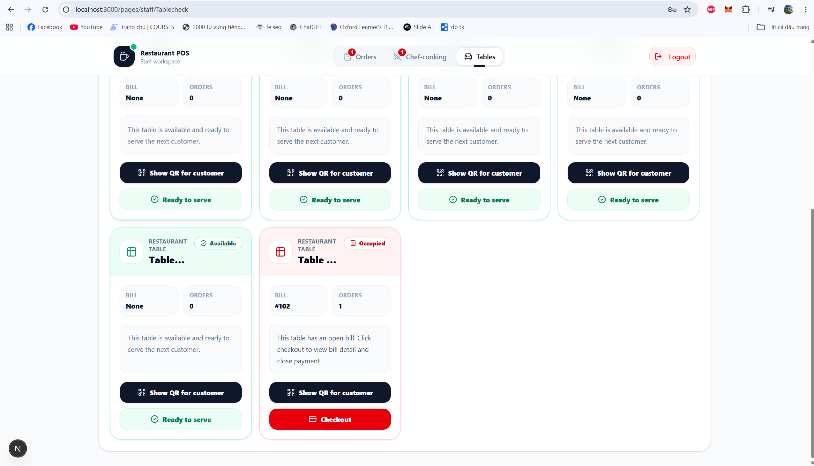

---

## Tổng quan chức năng

### Chức năng dành cho khách hàng

Khách hàng không cần tài khoản. Luồng sử dụng tập trung vào việc quét QR và gửi order nhanh tại bàn.

* Truy cập menu qua QR code của bàn.
* Xem danh sách món ăn từ database.
* Xem giá, danh mục, hình ảnh và option của món.
* Chọn size/option nếu món có cấu hình `options`.
* Thêm ghi chú cho từng món.
* Gửi order vào bill đang mở của bàn.
* Order sau khi gửi sẽ ở trạng thái chờ nhân viên duyệt.

---

### Chức năng dành cho Staff

Staff là nhân viên vận hành trong ca làm việc. Staff chủ yếu xử lý order và thanh toán.

* Đăng nhập bằng Supabase Auth.
* Sau khi đăng nhập, hệ thống kiểm tra role trong bảng `staff`.
* Truy cập workspace dành cho staff.
* Xem các order đang chờ duyệt.
* Duyệt order hợp lệ.
* Từ chối order không hợp lệ.
* Cập nhật trạng thái order trong quá trình phục vụ.
* Xem danh sách bàn.
* Xem bill đang mở của từng bàn.
* Kiểm tra chi tiết order/order item trong bill.
* Đóng bill khi khách thanh toán.

---

### Chức năng dành cho Admin

Admin có quyền quản lý toàn bộ dữ liệu vận hành của nhà hàng.

* Đăng nhập bằng Supabase Auth.
* Sau khi đăng nhập, hệ thống kiểm tra role `admin`.
* Truy cập Admin Workspace.
* Xem dashboard vận hành.
* Quản lý nhân viên.
* Quản lý món ăn.
* Upload/cập nhật hình ảnh món ăn.
* Quản lý bàn.
* Tạo/cập nhật QR code cho bàn.
* Quản lý hóa đơn.
* Xem bill đang mở và bill đã đóng.
* Theo dõi dữ liệu hoạt động của nhà hàng.

---

## Luồng hoạt động hệ thống

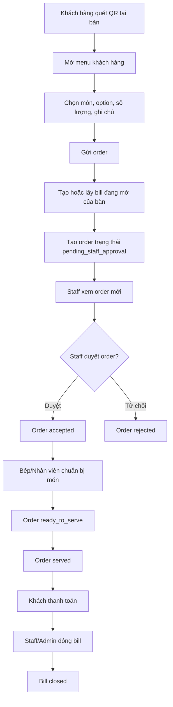

---

## Phân quyền người dùng

Hệ thống có 2 role chính được lưu trong bảng `staff`:

| Role    | Quyền                                                                           |
| ------- | ------------------------------------------------------------------------------- |
| `admin` | Quản lý dashboard, nhân viên, món ăn, bàn, QR code, hóa đơn và dữ liệu vận hành |
| `staff` | Xử lý order, kiểm tra bàn, xem bill và đóng hóa đơn                             |

Luồng đăng nhập:

1. Người dùng đăng nhập bằng Supabase Auth.
2. Frontend lấy session/access token.
3. Client gọi API `/api/auth/me`.
4. Server kiểm tra user hiện tại trong bảng `staff`.
5. Nếu role là `admin`, chuyển đến `/pages/admin`.
6. Nếu role là `staff`, chuyển đến `/pages/staff`.
7. Nếu không có role hợp lệ, hệ thống đăng xuất hoặc báo lỗi quyền truy cập.

---

## Tech stack

| Nhóm           | Công nghệ                     |
| -------------- | ----------------------------- |
| Framework      | Next.js 16                    |
| UI Library     | React 19                      |
| Styling        | Tailwind CSS 4                |
| Database       | Supabase PostgreSQL           |
| Authentication | Supabase Auth                 |
| API            | Next.js App Router API Routes |
| Chart          | Recharts                      |
| Icon           | Lucide React                  |
| QR Code        | qrcode.react                  |
| UI Primitives  | Radix UI                      |
| Utility        | clsx, tailwind-merge, uuid    |

---

## Cấu trúc thư mục

```text
ORDER/
├── public/
├── src/
│   ├── api/
│   │   ├── adminClient.js
│   │   └── client.js
│   │
│   ├── app/
│   │   ├── api/
│   │   │   ├── admin/
│   │   │   ├── auth/me/
│   │   │   ├── bill/
│   │   │   ├── dashboard/
│   │   │   ├── menu/upload-image/
│   │   │   ├── menu_items/
│   │   │   ├── order_items/
│   │   │   ├── orders/
│   │   │   └── table/
│   │   │
│   │   ├── features/
│   │   │   ├── Employee/
│   │   │   ├── Food/
│   │   │   ├── MainMenu/
│   │   │   ├── Table/
│   │   │   └── order/
│   │   │
│   │   ├── pages/
│   │   │   ├── admin/
│   │   │   │   ├── (routes)/
│   │   │   │   │   ├── Bill/
│   │   │   │   │   ├── Employee/
│   │   │   │   │   ├── Food/
│   │   │   │   │   ├── Table/
│   │   │   │   │   └── dashboard/
│   │   │   │   ├── layout.jsx
│   │   │   │   └── page.jsx
│   │   │   │
│   │   │   ├── staff/
│   │   │   │   ├── Chef/
│   │   │   │   ├── Tablecheck/
│   │   │   │   ├── order/
│   │   │   │   ├── layout.jsx
│   │   │   │   └── page.jsx
│   │   │   │
│   │   │   ├── forgot_password/
│   │   │   ├── reset-password/
│   │   │   └── page.jsx
│   │   │
│   │   ├── MainMenuClient.jsx
│   │   ├── globals.css
│   │   ├── layout.js
│   │   └── page.js
│   │
│   ├── components/
│   │   ├── auth/
│   │   ├── context/
│   │   ├── layout/
│   │   ├── ui/
│   │   └── CustomAlert.jsx
│   │
│   ├── controllers/
│   │   ├── billController.js
│   │   ├── menuItemController.js
│   │   ├── menuUploadController.js
│   │   ├── orderController.js
│   │   ├── orderItemController.js
│   │   ├── staffController.js
│   │   └── tableController.js
│   │
│   ├── hooks/
│   │
│   ├── lib/
│   │   ├── auth.js
│   │   └── utils.js
│   │
│   ├── models/
│   │   ├── billModel.js
│   │   ├── menuItemModel.js
│   │   ├── menuUploadModel.js
│   │   ├── orderItemModel.js
│   │   ├── orderModel.js
│   │   ├── staffModel.js
│   │   └── tableModel.js
│   │
│   ├── utils/
│   │   ├── authFetch.js
│   │   └── response.js
│   │
│   └── docs/
│       └── images/
│           ├── customer-menu.png
│           ├── admin-workspace.png
│           ├── admin-dashboard.png
│           ├── admin-employee.png
│           ├── admin-food.png
│           ├── admin-table.png
│           ├── admin-bill.png
│           ├── staff-workspace.png
│           ├── staff-orders.png
│           ├── staff-chef.png
│           └── staff-table-check.png
│
├── MVC_ARCHITECTURE_GUIDE.md
├── package.json
├── next.config.mjs
├── postcss.config.mjs
├── eslint.config.mjs
├── jsconfig.json
└── components.json
```

---

## Kiến trúc MVC-like

Dự án dùng kiến trúc gần giống MVC bên trong Next.js App Router.

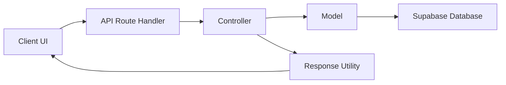

### 1. View/UI Layer

Bao gồm các page, layout và component giao diện.

Ví dụ:

* `src/app/page.js`
* `src/app/MainMenuClient.jsx`
* `src/app/pages/page.jsx`
* `src/app/pages/admin/page.jsx`
* `src/app/pages/staff/page.jsx`
* `src/app/features/Food/`
* `src/app/features/Table/`
* `src/app/features/Employee/`
* `src/app/features/MainMenu/`
* `src/app/features/order/`
* `src/components/`

Nhiệm vụ:

* Hiển thị giao diện.
* Gọi API.
* Quản lý trạng thái UI.
* Điều hướng người dùng theo role.
* Hiển thị form thêm/sửa/xóa dữ liệu.
* Hiển thị order, bill, table, menu item.

---

### 2. Route Layer

API Route nằm trong:

```text
src/app/api/
```

Nhiệm vụ:

* Nhận request từ client.
* Đọc query/body.
* Kiểm tra quyền truy cập bằng `requireRole`.
* Gọi controller tương ứng.
* Trả response về client.

Ví dụ:

```text
src/app/api/orders/route.js
src/app/api/bill/route.js
src/app/api/table/route.js
src/app/api/menu_items/route.js
src/app/api/admin/route.js
```

---

### 3. Controller Layer

Controller nằm trong:

```text
src/controllers/
```

Nhiệm vụ:

* Xử lý logic nghiệp vụ.
* Validate dữ liệu đầu vào.
* Gọi model để thao tác database.
* Chuẩn hóa response.
* Xử lý lỗi.

Ví dụ:

```text
billController.js
menuItemController.js
menuUploadController.js
orderController.js
orderItemController.js
staffController.js
tableController.js
```

---

### 4. Model Layer

Model nằm trong:

```text
src/models/
```

Nhiệm vụ:

* Giao tiếp trực tiếp với Supabase.
* Query dữ liệu.
* Insert/update/delete dữ liệu.
* Xử lý quan hệ giữa các bảng.
* Tính toán dữ liệu liên quan đến bill/order/menu/table.

Ví dụ:

```text
billModel.js
menuItemModel.js
menuUploadModel.js
orderItemModel.js
orderModel.js
staffModel.js
tableModel.js
```

---

### 5. Utility/Auth Layer

Các helper dùng chung nằm trong:

```text
src/lib/
src/utils/
src/api/
```

Bao gồm:

* Supabase client phía client.
* Supabase admin client phía server.
* Helper kiểm tra role.
* Wrapper `authFetch`.
* Response helper.
* Utility dùng chung cho UI/API.

---

## Database schema

Database dùng Supabase PostgreSQL với các bảng chính:

* `staff`
* `tables`
* `bills`
* `menu_items`
* `orders`
* `order_items`

### Quan hệ dữ liệu

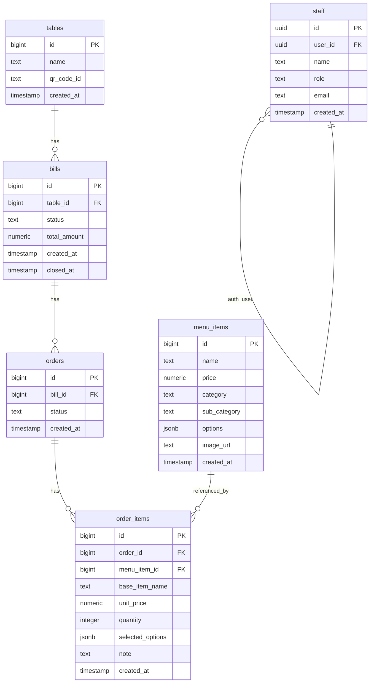

---

### Bảng `staff`

Lưu thông tin tài khoản nội bộ của nhà hàng. Bảng này liên kết với `auth.users` của Supabase thông qua `user_id`.

| Cột          | Kiểu dữ liệu               | Mô tả                       |
| ------------ | -------------------------- | --------------------------- |
| `id`         | `uuid`                     | Khóa chính của staff        |
| `user_id`    | `uuid`                     | ID user trong Supabase Auth |
| `name`       | `text`                     | Tên nhân viên               |
| `role`       | `text`                     | Role: `admin` hoặc `staff`  |
| `email`      | `text`                     | Email đăng nhập             |
| `created_at` | `timestamp with time zone` | Thời gian tạo               |

Role hợp lệ:

```text
admin
staff
```

---

### Bảng `tables`

Lưu danh sách bàn trong nhà hàng.

| Cột          | Kiểu dữ liệu               | Mô tả                    |
| ------------ | -------------------------- | ------------------------ |
| `id`         | `bigint`                   | Khóa chính               |
| `name`       | `text`                     | Tên bàn, ví dụ: Table 01 |
| `qr_code_id` | `text`                     | Mã QR duy nhất của bàn   |
| `created_at` | `timestamp with time zone` | Thời gian tạo            |

Mỗi bàn có một `qr_code_id` duy nhất để khách quét QR và gọi món đúng bàn.

---

### Bảng `bills`

Lưu hóa đơn của từng bàn.

| Cột            | Kiểu dữ liệu               | Mô tả                |
| -------------- | -------------------------- | -------------------- |
| `id`           | `bigint`                   | Khóa chính           |
| `table_id`     | `bigint`                   | Bàn tương ứng        |
| `status`       | `text`                     | `open` hoặc `closed` |
| `total_amount` | `numeric`                  | Tổng tiền hóa đơn    |
| `created_at`   | `timestamp with time zone` | Thời gian mở bill    |
| `closed_at`    | `timestamp with time zone` | Thời gian đóng bill  |

Trạng thái hợp lệ:

```text
open
closed
```

---

### Bảng `menu_items`

Lưu danh sách món ăn/thức uống.

| Cột            | Kiểu dữ liệu               | Mô tả                                |
| -------------- | -------------------------- | ------------------------------------ |
| `id`           | `bigint`                   | Khóa chính                           |
| `name`         | `text`                     | Tên món                              |
| `price`        | `numeric`                  | Giá gốc                              |
| `category`     | `text`                     | Danh mục chính                       |
| `sub_category` | `text`                     | Danh mục phụ                         |
| `options`      | `jsonb`                    | Option như size, topping, ice, sugar |
| `image_url`    | `text`                     | URL ảnh món                          |
| `created_at`   | `timestamp with time zone` | Thời gian tạo                        |

Ví dụ `options`:

```json
{
  "sizes": [
    {
      "name": "M",
      "price": 0
    },
    {
      "name": "L",
      "price": 10000
    }
  ],
  "toppings": [
    {
      "name": "Trân châu",
      "price": 5000
    }
  ]
}
```

---

### Bảng `orders`

Lưu từng lần khách gửi order trong một bill.

| Cột          | Kiểu dữ liệu               | Mô tả            |
| ------------ | -------------------------- | ---------------- |
| `id`         | `bigint`                   | Khóa chính       |
| `bill_id`    | `bigint`                   | Bill chứa order  |
| `status`     | `text`                     | Trạng thái order |
| `created_at` | `timestamp with time zone` | Thời gian tạo    |

Trạng thái hợp lệ:

```text
pending_staff_approval
accepted
ready_to_serve
rejected
served
```

Ý nghĩa trạng thái:

| Trạng thái               | Ý nghĩa                                       |
| ------------------------ | --------------------------------------------- |
| `pending_staff_approval` | Khách vừa gửi order, đang chờ nhân viên duyệt |
| `accepted`               | Nhân viên đã duyệt order                      |
| `ready_to_serve`         | Món đã sẵn sàng phục vụ                       |
| `rejected`               | Order bị từ chối                              |
| `served`                 | Order đã phục vụ xong                         |

---

### Bảng `order_items`

Lưu chi tiết từng món trong một order.

| Cột                | Kiểu dữ liệu               | Mô tả                       |
| ------------------ | -------------------------- | --------------------------- |
| `id`               | `bigint`                   | Khóa chính                  |
| `order_id`         | `bigint`                   | Order chứa món              |
| `menu_item_id`     | `bigint`                   | Món gốc trong menu          |
| `base_item_name`   | `text`                     | Tên món tại thời điểm order |
| `unit_price`       | `numeric`                  | Đơn giá tại thời điểm order |
| `quantity`         | `integer`                  | Số lượng                    |
| `selected_options` | `jsonb`                    | Option khách đã chọn        |
| `note`             | `text`                     | Ghi chú của khách           |
| `created_at`       | `timestamp with time zone` | Thời gian tạo               |

---

## SQL schema tham khảo

```sql
CREATE TABLE public.staff (
  user_id uuid NOT NULL UNIQUE,
  name text NOT NULL,
  role text NOT NULL CHECK (role = ANY (ARRAY['admin'::text, 'staff'::text])),
  email text NOT NULL UNIQUE,
  id uuid NOT NULL DEFAULT gen_random_uuid(),
  created_at timestamp with time zone DEFAULT now(),
  CONSTRAINT staff_pkey PRIMARY KEY (id),
  CONSTRAINT staff_user_id_fkey FOREIGN KEY (user_id) REFERENCES auth.users(id)
);

CREATE TABLE public.tables (
  id bigint GENERATED ALWAYS AS IDENTITY NOT NULL,
  name text NOT NULL UNIQUE,
  qr_code_id text NOT NULL UNIQUE,
  created_at timestamp with time zone NOT NULL DEFAULT now(),
  CONSTRAINT tables_pkey PRIMARY KEY (id)
);

CREATE TABLE public.bills (
  id bigint GENERATED ALWAYS AS IDENTITY NOT NULL,
  table_id bigint NOT NULL,
  closed_at timestamp with time zone,
  created_at timestamp with time zone NOT NULL DEFAULT now(),
  status text NOT NULL DEFAULT 'open'::text CHECK (status = ANY (ARRAY['open'::text, 'closed'::text])),
  total_amount numeric NOT NULL DEFAULT 0,
  CONSTRAINT bills_pkey PRIMARY KEY (id),
  CONSTRAINT bills_table_id_fkey FOREIGN KEY (table_id) REFERENCES public.tables(id)
);

CREATE TABLE public.menu_items (
  id bigint GENERATED ALWAYS AS IDENTITY NOT NULL,
  name text NOT NULL,
  price numeric NOT NULL CHECK (price >= 0::numeric),
  category text NOT NULL,
  sub_category text,
  options jsonb,
  created_at timestamp with time zone NOT NULL DEFAULT now(),
  image_url text,
  CONSTRAINT menu_items_pkey PRIMARY KEY (id)
);

CREATE TABLE public.orders (
  id bigint GENERATED ALWAYS AS IDENTITY NOT NULL,
  bill_id bigint NOT NULL,
  created_at timestamp with time zone NOT NULL DEFAULT now(),
  status text NOT NULL DEFAULT 'pending_staff_approval'::text CHECK (
    status = ANY (
      ARRAY[
        'pending_staff_approval'::text,
        'accepted'::text,
        'ready_to_serve'::text,
        'rejected'::text,
        'served'::text
      ]
    )
  ),
  CONSTRAINT orders_pkey PRIMARY KEY (id),
  CONSTRAINT orders_bill_id_fkey FOREIGN KEY (bill_id) REFERENCES public.bills(id)
);

CREATE TABLE public.order_items (
  id bigint GENERATED ALWAYS AS IDENTITY NOT NULL,
  order_id bigint NOT NULL,
  unit_price numeric NOT NULL CHECK (unit_price >= 0::numeric),
  note text,
  base_item_name text NOT NULL,
  selected_options jsonb,
  menu_item_id bigint,
  created_at timestamp with time zone NOT NULL DEFAULT now(),
  quantity integer NOT NULL DEFAULT 1 CHECK (quantity > 0),
  CONSTRAINT order_items_pkey PRIMARY KEY (id),
  CONSTRAINT order_items_order_id_fkey FOREIGN KEY (order_id) REFERENCES public.orders(id),
  CONSTRAINT order_items_menu_item_id_fkey FOREIGN KEY (menu_item_id) REFERENCES public.menu_items(id)
);
```

---

## API routes

### Auth

| Method | Endpoint       | Mục đích                                               | Quyền        |
| ------ | -------------- | ------------------------------------------------------ | ------------ |
| `GET`  | `/api/auth/me` | Lấy thông tin user hiện tại và role trong bảng `staff` | Đã đăng nhập |

---

### Admin / Staff Management

| Method   | Endpoint             | Mục đích                 | Quyền |
| -------- | -------------------- | ------------------------ | ----- |
| `GET`    | `/api/admin`         | Lấy danh sách nhân viên  | Admin |
| `POST`   | `/api/admin`         | Tạo nhân viên            | Admin |
| `PUT`    | `/api/admin?id={id}` | Cập nhật nhân viên       | Admin |
| `PATCH`  | `/api/admin?id={id}` | Reset mật khẩu nhân viên | Admin |
| `DELETE` | `/api/admin?id={id}` | Xóa nhân viên            | Admin |

---

### Admin Stats

| Method | Endpoint           | Mục đích                                  | Quyền |
| ------ | ------------------ | ----------------------------------------- | ----- |
| `GET`  | `/api/admin/stats` | Lấy số liệu tổng quan cho Admin Workspace | Admin |

---

### Dashboard

| Method | Endpoint         | Mục đích                                        | Quyền |
| ------ | ---------------- | ----------------------------------------------- | ----- |
| `GET`  | `/api/dashboard` | Lấy dữ liệu dashboard, metrics và recent orders | Admin |

---

### Menu Items

| Method   | Endpoint                  | Mục đích          | Quyền              |
| -------- | ------------------------- | ----------------- | ------------------ |
| `GET`    | `/api/menu_items`         | Lấy danh sách món | Public/Admin/Staff |
| `POST`   | `/api/menu_items`         | Thêm món mới      | Admin              |
| `PUT`    | `/api/menu_items?id={id}` | Cập nhật món      | Admin              |
| `DELETE` | `/api/menu_items?id={id}` | Xóa món           | Admin              |

---

### Menu Upload Image

| Method | Endpoint                 | Mục đích          | Quyền |
| ------ | ------------------------ | ----------------- | ----- |
| `POST` | `/api/menu/upload-image` | Upload ảnh món ăn | Admin |

---

### Tables

| Method   | Endpoint             | Mục đích                            | Quyền              |
| -------- | -------------------- | ----------------------------------- | ------------------ |
| `GET`    | `/api/table`         | Lấy danh sách bàn                   | Public/Admin/Staff |
| `POST`   | `/api/table`         | Tạo bàn mới                         | Admin              |
| `PUT`    | `/api/table?id={id}` | Cập nhật bàn                        | Admin              |
| `PATCH`  | `/api/table?id={id}` | Cập nhật thông tin bàn hoặc QR code | Admin              |
| `DELETE` | `/api/table?id={id}` | Xóa bàn                             | Admin              |

---

### Bills

| Method  | Endpoint                  | Mục đích                      | Quyền       |
| ------- | ------------------------- | ----------------------------- | ----------- |
| `GET`   | `/api/bill`               | Lấy danh sách bill đang mở    | Admin/Staff |
| `GET`   | `/api/bill?scope=all`     | Lấy toàn bộ bill kèm thống kê | Admin/Staff |
| `POST`  | `/api/bill`               | Lấy chi tiết bill theo ID     | Admin/Staff |
| `PATCH` | `/api/bill?action=close`  | Đóng bill theo bill ID        | Admin/Staff |
| `PATCH` | `/api/bill?action=status` | Đóng bill theo table ID       | Admin/Staff |

---

### Orders

| Method   | Endpoint              | Mục đích                           | Quyền       |
| -------- | --------------------- | ---------------------------------- | ----------- |
| `GET`    | `/api/orders`         | Lấy danh sách order đang chờ xử lý | Admin/Staff |
| `POST`   | `/api/orders`         | Tạo order mới từ khách hàng        | Public      |
| `PATCH`  | `/api/orders?id={id}` | Cập nhật trạng thái order          | Admin/Staff |
| `DELETE` | `/api/orders?id={id}` | Xóa order                          | Admin/Staff |

---

### Order Items

| Method   | Endpoint                   | Mục đích            | Quyền       |
| -------- | -------------------------- | ------------------- | ----------- |
| `PUT`    | `/api/order_items?id={id}` | Cập nhật order item | Admin/Staff |
| `DELETE` | `/api/order_items?id={id}` | Xóa order item      | Admin/Staff |

---

## Các route giao diện chính

| Route                     | Giao diện           | Mô tả                                        |
| ------------------------- | ------------------- | -------------------------------------------- |
| `/`                       | Customer Menu       | Trang menu khách hàng khi quét QR            |
| `/pages`                  | Login/Auth          | Trang đăng nhập, kiểm tra role và điều hướng |
| `/pages/admin`            | Admin Workspace     | Trang tổng quan admin                        |
| `/pages/admin/dashboard`  | Admin Dashboard     | Dashboard thống kê                           |
| `/pages/admin/Employee`   | Employee Management | Quản lý nhân viên                            |
| `/pages/admin/Food`       | Food Management     | Quản lý món ăn                               |
| `/pages/admin/Table`      | Table Management    | Quản lý bàn và QR                            |
| `/pages/admin/Bill`       | Bill Management     | Quản lý hóa đơn                              |
| `/pages/staff`            | Staff Workspace     | Trang tổng quan nhân viên                    |
| `/pages/staff/order`      | Staff Orders        | Xử lý order                                  |
| `/pages/staff/Chef`       | Staff Chef          | Theo dõi order theo hướng bếp/phục vụ        |
| `/pages/staff/Tablecheck` | Table Check         | Kiểm tra bàn và thanh toán                   |
| `/pages/forgot_password`  | Forgot Password     | Quên mật khẩu                                |
| `/pages/reset-password`   | Reset Password      | Đặt lại mật khẩu                             |

---

## Biến môi trường

Tạo file `.env.local` ở thư mục gốc dự án:

```env
NEXT_PUBLIC_SUPABASE_URL=your-supabase-url
NEXT_PUBLIC_SUPABASE_ANON_KEY=your-supabase-anon-key
SUPABASE_SERVICE_ROLE_KEY=your-supabase-service-role-key
NEXT_PUBLIC_APP_URL=your-app-url
```

Ý nghĩa:

| Biến                            | Mô tả                                                  |
| ------------------------------- | ------------------------------------------------------ |
| `NEXT_PUBLIC_SUPABASE_URL`      | URL project Supabase                                   |
| `NEXT_PUBLIC_SUPABASE_ANON_KEY` | Public anon key dùng phía client                       |
| `SUPABASE_SERVICE_ROLE_KEY`     | Service role key dùng cho server-side/admin operations |
| `NEXT_PUBLIC_APP_URL`           | URL của ứng dụng, dùng khi tạo link/QR hoặc redirect   |

> `SUPABASE_SERVICE_ROLE_KEY` là key nhạy cảm. Không public key này, không commit `.env.local` lên GitHub.

---

## Cài đặt và chạy dự án

### 1. Cài dependencies

```bash
npm install
```

### 2. Chạy môi trường development

```bash
npm run dev
```

Sau đó mở:

```text
http://localhost:3000
```

### 3. Build production

```bash
npm run build
```

### 4. Start production

```bash
npm run start
```

### 5. Lint code

```bash
npm run lint
```

---

## Scripts

| Script          | Mô tả                           |
| --------------- | ------------------------------- |
| `npm run dev`   | Chạy Next.js development server |
| `npm run build` | Build production                |
| `npm run start` | Chạy production server          |
| `npm run lint`  | Kiểm tra lint                   |

---

## Ghi chú vận hành

### 1. Tạo tài khoản admin/staff

Người dùng đăng nhập bằng Supabase Auth, nhưng quyền truy cập hệ thống được xác định qua bảng `staff`.

Một user hợp lệ cần có:

* Tài khoản trong Supabase Auth.
* Bản ghi tương ứng trong bảng `staff`.
* `user_id` trỏ đến `auth.users.id`.
* `role` là `admin` hoặc `staff`.

Nếu user đăng nhập được nhưng không có record trong bảng `staff`, hệ thống sẽ không điều hướng vào admin/staff workspace.

---

### 2. QR code theo bàn

Mỗi bàn có một `qr_code_id` duy nhất. QR code dùng để xác định khách đang gọi món tại bàn nào.

Luồng QR:

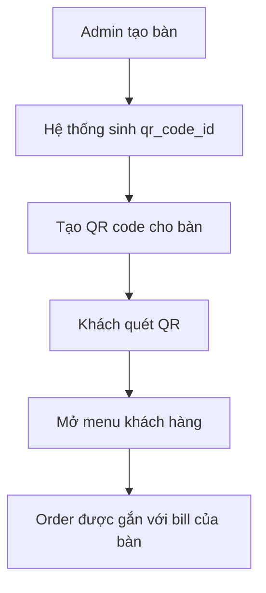

---

### 3. Bill đang mở

Một bàn có thể có bill ở trạng thái `open`. Khi khách gọi món, hệ thống cần bill đang mở để gắn order vào.

Khi khách thanh toán:

* Staff/Admin kiểm tra chi tiết bill.
* Tổng tiền được tính từ các order item.
* Bill được chuyển sang trạng thái `closed`.
* `closed_at` được cập nhật.

---

### 4. Order status

Order được quản lý theo vòng đời:

```text
pending_staff_approval -> accepted -> ready_to_serve -> served
```

Nếu order không hợp lệ:

```text
pending_staff_approval -> rejected
```

---

### 5. Hình ảnh món ăn

Món ăn có trường `image_url`, dùng để hiển thị ảnh trong menu khách hàng và màn hình quản lý món ăn.

API upload ảnh nằm tại:

```text
/api/menu/upload-image
```

---

## Troubleshooting

### Không đăng nhập được

Kiểm tra:

* Supabase URL và anon key trong `.env.local`.
* User đã tồn tại trong Supabase Auth.
* User đã có record tương ứng trong bảng `staff`.

---

### Đăng nhập xong không vào admin/staff

Kiểm tra:

* `staff.user_id` có đúng với `auth.users.id` không.
* `staff.role` có phải `admin` hoặc `staff` không.
* API `/api/auth/me` có trả về `success: true` không.

---

### Admin dashboard không có dữ liệu

Kiểm tra:

* Database đã có dữ liệu `tables`, `bills`, `orders`, `order_items`.
* User hiện tại có role `admin`.
* API `/api/admin/stats` và `/api/dashboard` hoạt động đúng.
* Access token được gửi kèm request.

---

### Ảnh trong README không hiển thị

README đang dùng các đường dẫn:

```text
src/docs/images/customer-menu.png
src/docs/images/admin-workspace.png
src/docs/images/admin-dashboard.png
src/docs/images/admin-employee.png
src/docs/images/admin-food.png
src/docs/images/admin-table.png
src/docs/images/admin-bill.png
src/docs/images/staff-workspace.png
src/docs/images/staff-orders.png
src/docs/images/staff-chef.png
src/docs/images/staff-table-check.png
```

Ảnh sẽ hiển thị khi các file này tồn tại đúng trong repo và đã được push lên GitHub.

---

## Tóm tắt giá trị dự án

Order Web mô phỏng một hệ thống order nhà hàng thực tế với đầy đủ các phần quan trọng:

* Menu khách hàng qua QR.
* Quản lý order theo trạng thái.
* Quản lý bill theo bàn.
* Phân quyền admin/staff.
* Quản lý nhân viên.
* Quản lý món ăn.
* Quản lý bàn và QR code.
* Dashboard vận hành.
* API được tách theo controller/model.
* Database có quan hệ rõ ràng giữa bàn, bill, order và order item.

Dự án phù hợp để làm đồ án, portfolio hoặc nền tảng phát triển tiếp thành hệ thống order nhà hàng thực tế.

---

## Tác giả

Repository: `nguyenvanthanh1501bmt-hash/ORDER`

---

## License

This project is provided as-is.
